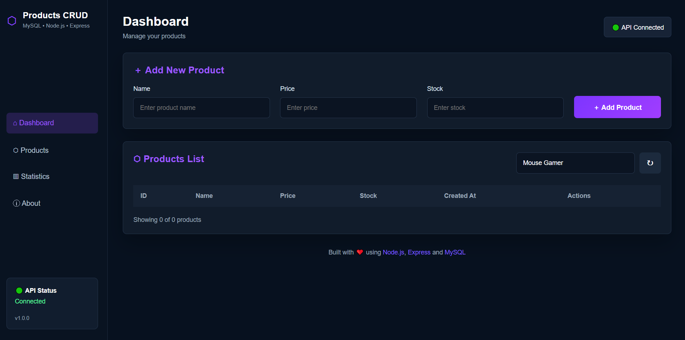
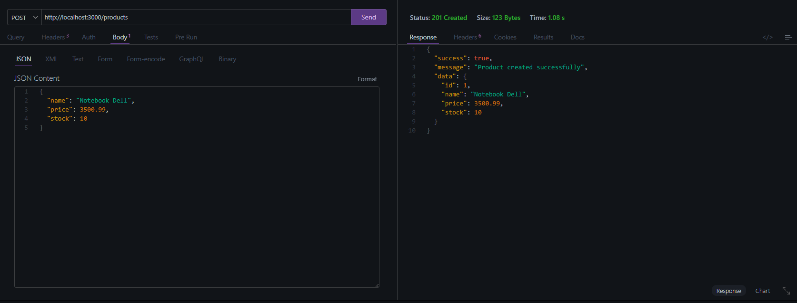
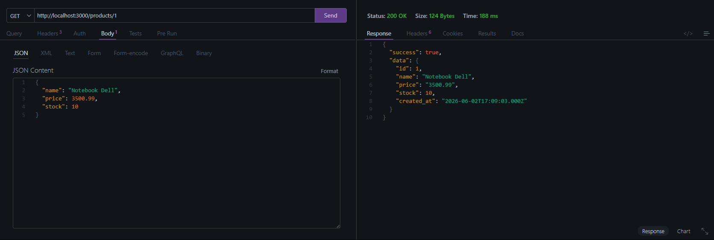
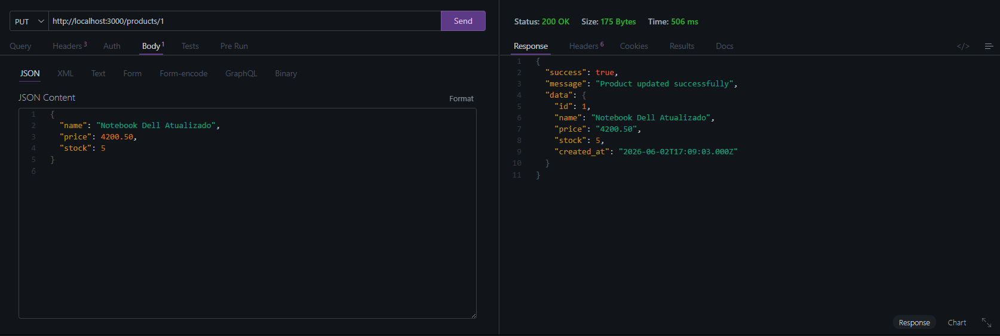
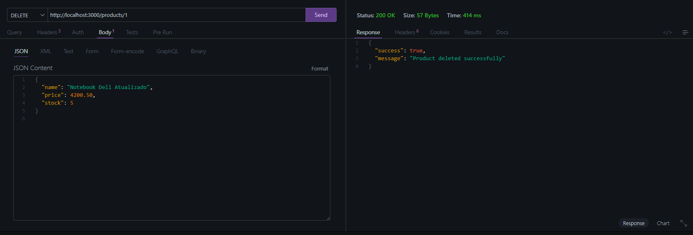
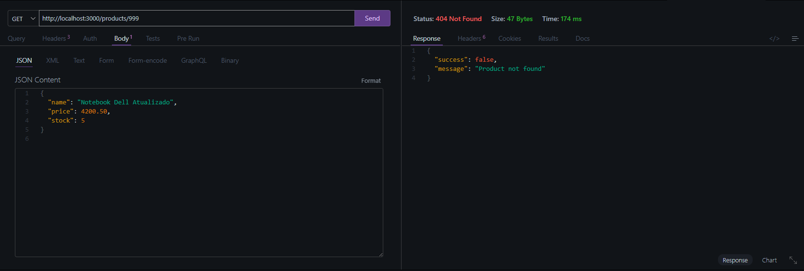

# 🚀 Products CRUD API


A complete CRUD API built with **Node.js**, **Express**, **MySQL**, and **Zod**, developed as part of the **Nova Era Tech Backend JS Challenge #01**.

This project demonstrates a real-world backend architecture with layered organization, data validation, error handling, cloud database integration, and a frontend dashboard for product management.

---

# 🌟 Overview

This project was developed as part of the Nova Era Tech Backend JS Formation.

The goal was to build a complete CRUD API using a SQL database, following a layered architecture and industry best practices.

To go beyond the challenge requirements, a frontend dashboard was also developed, allowing product management through a modern user interface connected directly to the API.

---

# 📸 Project Preview

## 🖥️ Frontend Dashboard



## ➕ Create Product



## 🔍 Get Product By ID



## ✏️ Update Product


## 🗑️ Delete Product



## ❌ Error Handling



---

# 🛠️ Technologies

## Backend

* Node.js
* Express.js
* MySQL
* mysql2
* Zod
* Dotenv
* CORS

## Database

* Aiven MySQL Cloud Database

## Frontend

* HTML5
* CSS3
* JavaScript (Vanilla JS)

---

# 📂 Project Structure

```txt
crud-mysql-desafio01/
│
├── frontend/
│   ├── index.html
│   ├── style.css
│   └── script.js
│
├── src/
│   ├── config/
│   │   └── database.js
│   │
│   ├── controllers/
│   │   └── productController.js
│   │
│   ├── repositories/
│   │   └── productRepository.js
│   │
│   ├── routes/
│   │   └── productRoutes.js
│   │
│   ├── schemas/
│   │   └── productSchema.js
│   │
│   ├── services/
│   │   └── productService.js
│   │
│   └── server.js
│
├── sql/
│   └── create-products-table.sql
│
├── image/
│   ├── front.png
│   ├── post.png
│   ├── get.png
│   ├── put.png
│   ├── delet.png
│   └── erro.png
│
├── .gitignore
├── package.json
├── package-lock.json
└── README.md
```

---

# ⚙️ Environment Variables

Create a `.env` file:

```env
PORT=3000

DB_HOST=your-host
DB_PORT=your-port
DB_USER=your-user
DB_PASSWORD=your-password
DB_NAME=your-database
```

---

# 📦 Installation

Clone the repository:

```bash
git clone https://github.com/Vitor2209/crud-mysql-desafio01.git
```

Navigate to the project:

```bash
cd crud-mysql-desafio01
```

Install dependencies:

```bash
npm install
```

Start the server:

```bash
npm run dev
```

---

# 🗄️ Database

Create the products table:

```sql
CREATE TABLE IF NOT EXISTS products (
    id INT AUTO_INCREMENT PRIMARY KEY,
    name VARCHAR(255) NOT NULL,
    price DECIMAL(10,2) NOT NULL,
    stock INT NOT NULL,
    created_at TIMESTAMP DEFAULT CURRENT_TIMESTAMP
);
```

---

# 📌 API Endpoints

## Create Product

```http
POST /products
```

Body:

```json
{
  "name": "Notebook Dell",
  "price": 3500.99,
  "stock": 10
}
```

---

## Get All Products

```http
GET /products
```

---

## Get Product By ID

```http
GET /products/:id
```

---

## Update Product

```http
PUT /products/:id
```

Body:

```json
{
  "name": "Notebook Dell Updated",
  "price": 4200.50,
  "stock": 5
}
```

---

## Delete Product

```http
DELETE /products/:id
```

---

# ✅ Features

* Create products
* List products
* Search products by ID
* Update products
* Delete products
* Input validation with Zod
* Error handling
* MySQL cloud database
* Frontend dashboard
* RESTful architecture
* Layered architecture
* Cloud database integration

---

# 🎯 Challenge Goals Achieved

* ✅ Node.js API
* ✅ Express Routes
* ✅ MySQL Integration
* ✅ CRUD Operations
* ✅ Layered Architecture
* ✅ Input Validation
* ✅ Environment Variables
* ✅ Error Handling
* ✅ HTTP Status Codes
* ✅ Frontend Integration
* ✅ Cloud Database Connection

---

# 🚀 Future Improvements

* Pagination
* Product search by name
* Product sorting by price
* Swagger Documentation
* JWT Authentication
* Docker Containerization
* Unit Tests with Jest
* Deployment on Render
* CI/CD Pipeline
* Role-Based Access Control

---

# 👨‍💻 Author

**Vitor Dutra Melo**

Backend Developer

GitHub:
https://github.com/Vitor2209

LinkedIn:
https://www.linkedin.com/in/vitordutramelo

Instagram:
https://instagram.com/vitormelodev

---

# 🏆 Nova Era Tech

Backend JS Formation

### Challenge 01 — CRUD with MySQL

✔ Successfully Completed

**XP Earned:** +500 XP

---

Made with ❤️ using Node.js, Express, MySQL and JavaScript.
