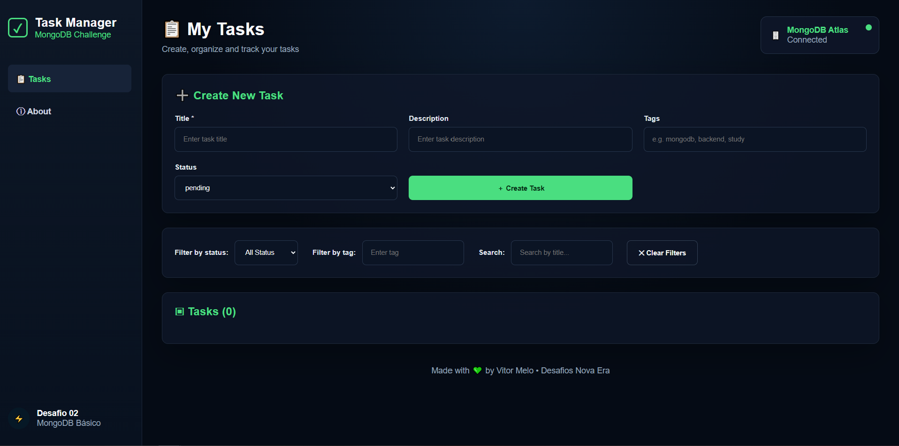
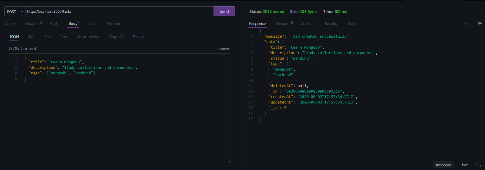
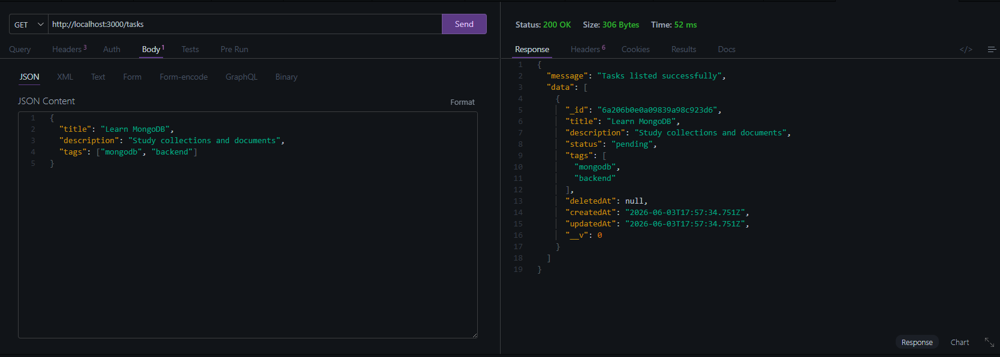
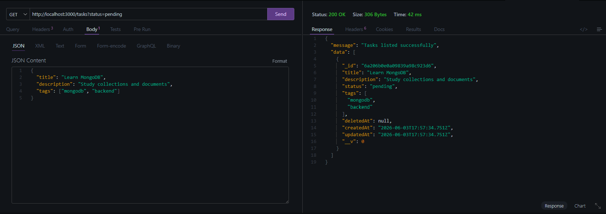

# 🚀 MongoDB Tasks API

A complete CRUD API built with **Node.js**, **Express**, **MongoDB Atlas**, **Mongoose**, and **Zod**.

This project was developed as part of the **Nova Era Tech Backend Challenge #02**, focusing on NoSQL databases, document modeling, filtering, validation, and REST API development.

---

# 📸 Project Preview

## 🖥️ Backend Running



## ➕ Create Task



## 📋 List Tasks



## 🔄 Filter Pending Tasks



---

# 🛠️ Technologies

### Backend

* Node.js
* Express.js
* MongoDB Atlas
* Mongoose
* Zod
* Dotenv
* Nodemon

### Database

* MongoDB Atlas
* Collections
* Documents
* NoSQL Queries

---

# 📂 Project Structure

```txt
backend/
│
├── src/
│   ├── config/
│   ├── controllers/
│   ├── middlewares/
│   ├── models/
│   ├── routes/
│   ├── schemas/
│   ├── app.js
│   └── server.js
│
├── package.json
├── .env
└── .gitignore
```

---

# 📋 Features

### Create Tasks

Create tasks with:

* Title
* Description
* Status
* Tags

### List Tasks

Retrieve all tasks stored in MongoDB.

### Filter Tasks

Filter by:

* Status
* Tag
* Search by title

### Update Status

Change task status:

* pending
* in_progress
* done

### Soft Delete

Tasks are not permanently removed.

A `deletedAt` field is used to mark deleted records.

---

# 📡 API Endpoints

## Create Task

```http
POST /tasks
```

Body:

```json
{
  "title": "Learn MongoDB",
  "description": "Study collections and documents",
  "status": "pending",
  "tags": ["mongodb", "backend"]
}
```

---

## Get All Tasks

```http
GET /tasks
```

---

## Filter By Status

```http
GET /tasks?status=pending
```

---

## Filter By Tag

```http
GET /tasks?tag=mongodb
```

---

## Search By Title

```http
GET /tasks?search=mongo
```

---

## Update Status

```http
PATCH /tasks/:id/status
```

Body:

```json
{
  "status": "done"
}
```

---

## Delete Task

```http
DELETE /tasks/:id
```

---

# 🔒 Validation

Implemented using Zod.

Validations include:

* Required title
* Valid status values
* Payload validation
* Error responses

---

# 🌐 MongoDB Atlas

The application uses MongoDB Atlas as a cloud database service.

Features used:

* Cluster
* Collections
* Documents
* Cloud persistence

---

# 🚀 Running Locally

Install dependencies:

```bash
npm install
```

Create `.env`:

```env
PORT=3000

MONGODB_URI=your_connection_string
```

Start server:

```bash
npm run dev
```

Server:

```txt
http://localhost:3000
```

---

# 🎯 Challenge Goals Achieved

* ✅ MongoDB Atlas connection
* ✅ Collections and documents
* ✅ CRUD operations
* ✅ Filters
* ✅ Validation
* ✅ Error handling
* ✅ Soft Delete
* ✅ Search with Regex
* ✅ Clean project structure

---

# 👨‍💻 Author

### Vitor Dutra Melo

Backend Developer

GitHub:
https://github.com/Vitor2209

LinkedIn:
https://www.linkedin.com/in/vitordutramelo

Instagram:
https://instagram.com/vitormelodev
