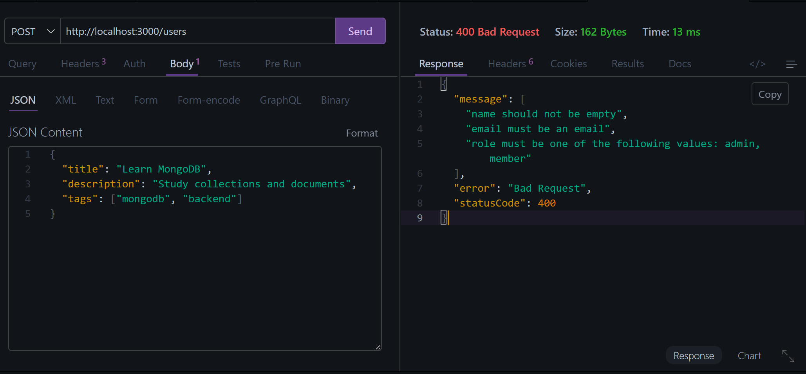
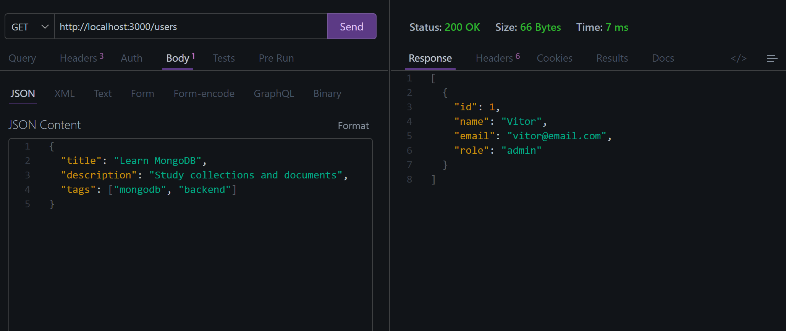
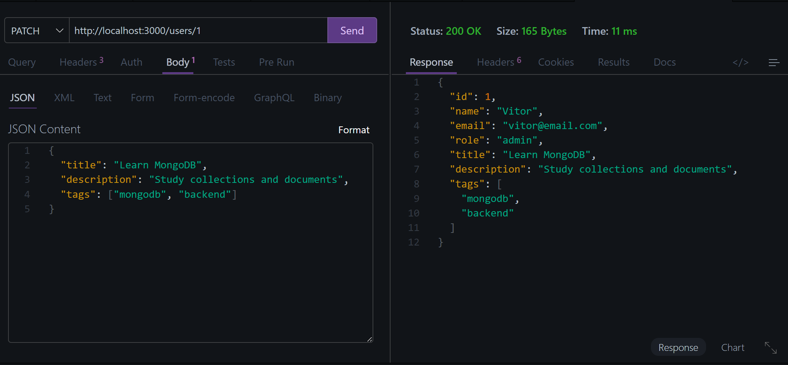
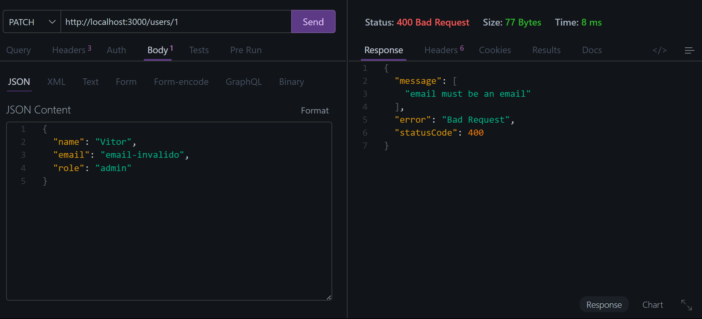

# 🚀 NestJS Users API

A REST API built with **NestJS**, **TypeScript**, DTOs, Validation Pipes, and Dependency Injection.

This project was developed as part of the **Nova Era Tech Backend Challenge #03**, focusing on modular architecture, request validation, and clean code practices.

---

# 📸 Project Preview

## ➕ Create User



---

## 📋 Get Users



---

## ✏️ Update User



---

## ❌ Validation Error



---

# 🛠 Technologies

* NestJS
* TypeScript
* Class Validator
* Class Transformer
* Dependency Injection
* Validation Pipes
* REST API

---

# 📂 Project Structure

```text
src/
├── users/
│   ├── dto/
│   │   ├── create-user.dto.ts
│   │   └── update-user.dto.ts
│   ├── users.controller.ts
│   ├── users.service.ts
│   └── users.module.ts
├── app.module.ts
└── main.ts
```

---

# 🚀 Features

* Create users
* List all users
* Get user by ID
* Update users
* Request validation
* Error handling
* Dependency Injection
* Modular architecture

---

# 📡 Endpoints

## Create User

```http
POST /users
```

Body:

```json
{
  "name": "Vitor",
  "email": "vitor@email.com",
  "role": "admin"
}
```

---

## Get All Users

```http
GET /users
```

---

## Get User By ID

```http
GET /users/:id
```

---

## Update User

```http
PATCH /users/:id
```

Body:

```json
{
  "role": "member"
}
```

---

# ✅ Validation Examples

Invalid request:

```json
{
  "name": "",
  "email": "invalid-email",
  "role": "test"
}
```

Response:

```json
{
  "statusCode": 400,
  "message": [
    "name should not be empty",
    "email must be an email",
    "role must be one of the following values: admin, member"
  ],
  "error": "Bad Request"
}
```

---

# 🧪 Running Locally

Install dependencies:

```bash
npm install
```

Start development server:

```bash
npx nest start --watch
```

Server:

```text
http://localhost:3000
```

---

# 🎯 Challenge Goals Achieved

✅ NestJS Architecture

✅ Controllers

✅ Services

✅ Modules

✅ DTOs

✅ Validation Pipes

✅ Error Handling

✅ Dependency Injection

✅ TypeScript

---

# 👨‍💻 Author

**Vitor Dutra Melo**

Backend Developer focused on Node.js, TypeScript, NestJS, PostgreSQL, Prisma, and scalable API development.

GitHub:
https://github.com/vitordutramelo
