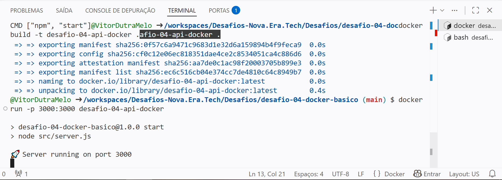
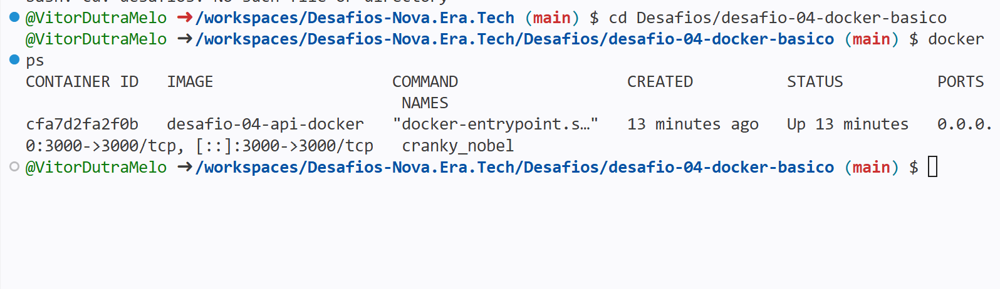
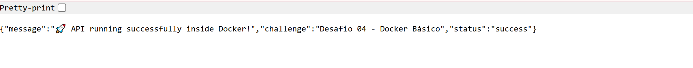

# 🚀 Desafio 04 — Docker Básico

Uma API desenvolvida com **Node.js** e **Express** totalmente containerizada com **Docker**, permitindo execução consistente em qualquer ambiente.

---

## 📸 Demonstração

### 🐳 Docker Build



---

### 🚀 Container em Execução



---

### 🌐 API Rodando no Container



---

## 🎯 Objetivo

Containerizar uma aplicação Node.js utilizando Docker, criando uma imagem reproduzível e executando a API dentro de um container.

---

## 🧠 Tecnologias Utilizadas

* Node.js
* Express.js
* Docker
* Dockerfile
* Variáveis de Ambiente

---

## 📁 Estrutura do Projeto

```txt
desafio-04-docker-basico/
│
├── image/
│   ├── api.png
│   ├── docker-ps.png
│   └── Screenshot.png
│
├── src/
│   ├── app.js
│   └── server.js
│
├── .dockerignore
├── .env.example
├── Dockerfile
├── package.json
└── README.md
```

---

## ▶️ Executar Localmente

Instalar dependências:

```bash
npm install
```

Executar aplicação:

```bash
npm run dev
```

Servidor:

```txt
http://localhost:3000
```

---

## 🐳 Docker

### Build da imagem

```bash
docker build -t desafio-04-api-docker .
```

### Executar container

```bash
docker run -p 3000:3000 desafio-04-api-docker
```

### Verificar container

```bash
docker ps
```

---

## 🌐 Endpoints

### Home

```http
GET /
```

Resposta:

```json
{
  "message": "🚀 API running successfully inside Docker!",
  "challenge": "Desafio 04 - Docker Básico",
  "status": "success"
}
```

---

### Health Check

```http
GET /health
```

---

### Users

```http
GET /users
```

---

## ✅ Critérios Atendidos

* Dockerfile criado
* Imagem Docker gerada
* Container executado com sucesso
* Porta 3000 exposta
* API acessível externamente
* Variáveis de ambiente configuradas
* Build reproduzível em qualquer ambiente

---

## 📚 Conceitos Praticados

* Docker
* Dockerfile
* Containers
* Imagens Docker
* Port Mapping
* Variáveis de Ambiente
* Containerização de APIs Node.js

---

## 🏁 Resultado

A aplicação foi containerizada com sucesso e executada dentro de um container Docker, demonstrando os conceitos fundamentais de Docker para aplicações backend.

---

## 👨‍💻 Autor

**Vitor Dutra Melo**

Backend Developer | Node.js | Express | PostgreSQL | Prisma ORM

Projeto desenvolvido para a trilha de desafios da **Nova Era Tech**.
