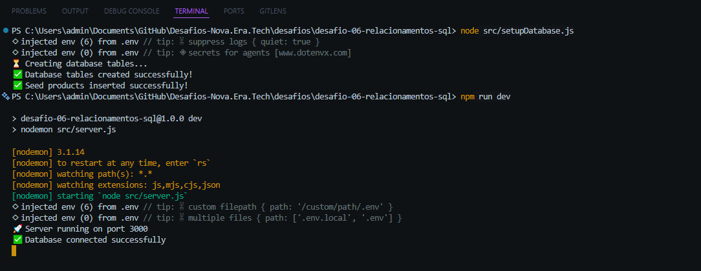
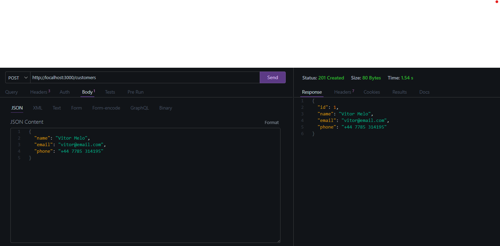
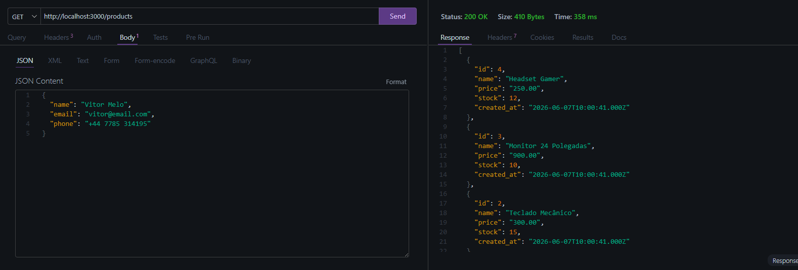
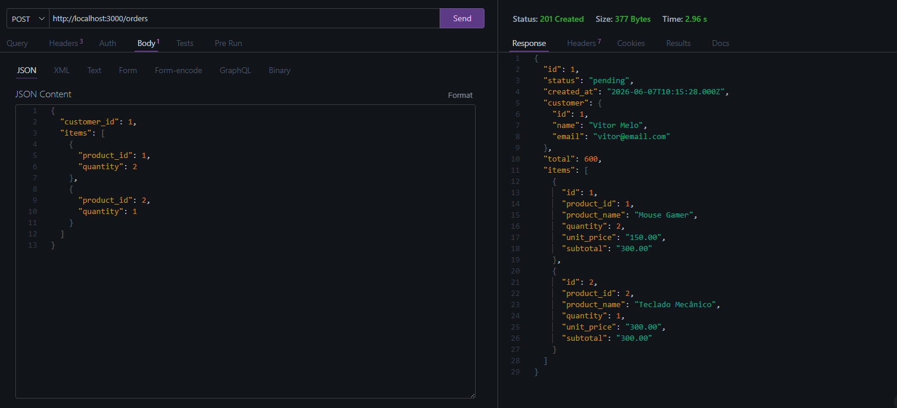
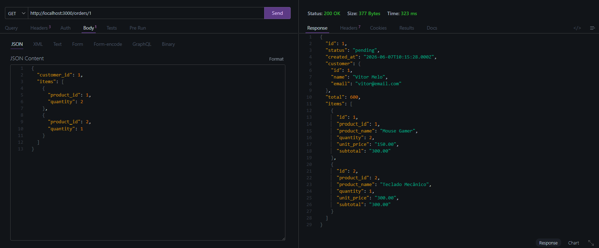
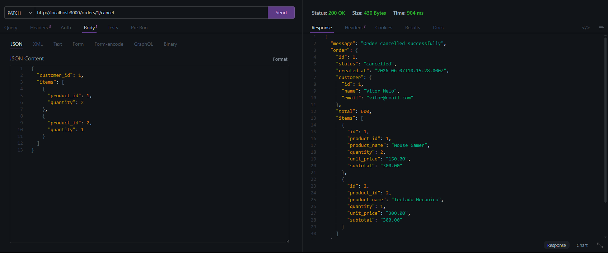

# 🚀 Challenge 06 — SQL Relationships API

A complete REST API built with **Node.js**, **Express**, **MySQL**, and **Zod**, developed as part of the **Nova Era Tech Backend Challenge**.

This project demonstrates real-world relational database modeling using:

* One-to-Many Relationships
* Foreign Keys
* SQL JOINs
* Referential Integrity
* Transactions
* Business Rules Validation
* Pagination
* Order Management

---

# 📸 Project Preview

## 🚀 Server Running



---

## 👤 Create Customer



---

## 📦 List Products



---

## 🛒 Create Order



---

## 🔍 Get Order By ID



---

## ❌ Cancel Order



---

# 🛠️ Technologies

### Backend

* Node.js
* Express.js
* MySQL
* mysql2
* Zod
* Dotenv
* Nodemon
* Thunder Client

---

# 📂 Project Structure

```bash
desafio-06-relacionamentos-sql/

├── database/
│   ├── schema.sql
│   └── seed.sql
│
├── images/
│   ├── buscar-pedido.png
│   ├── cacelar-pedido.png
│   ├── create.png
│   ├── criar-pedido.png
│   ├── listar-produtos.png
│   └── terminal.png
│
├── src/
│
│   ├── config/
│   │   └── database.js
│
│   ├── controllers/
│   │   ├── customerController.js
│   │   ├── productController.js
│   │   └── orderController.js
│
│   ├── middlewares/
│   │   ├── errorHandler.js
│   │   └── notFound.js
│
│   ├── repositories/
│   │   ├── customerRepository.js
│   │   ├── productRepository.js
│   │   └── orderRepository.js
│
│   ├── routes/
│   │   ├── customerRoutes.js
│   │   ├── productRoutes.js
│   │   └── orderRoutes.js
│
│   ├── services/
│   │   ├── customerService.js
│   │   ├── productService.js
│   │   └── orderService.js
│
│   ├── validations/
│   │   ├── customerValidation.js
│   │   ├── productValidation.js
│   │   └── orderValidation.js
│
│   ├── app.js
│   ├── server.js
│   └── setupDatabase.js
│
├── .env.example
├── .gitignore
├── package.json
└── README.md
```

---

# 🗄️ Database Model

## Customers

Stores customer information.

```sql
d06_customers
```

---

## Products

Stores products and stock quantity.

```sql
d06_products
```

---

## Orders

Stores customer orders.

```sql
d06_orders
```

---

## Order Items

Stores products associated with orders.

```sql
d06_order_items
```

---

# 🔗 Relationships

```text
Customers (1) -------- (N) Orders

Orders (1) ----------- (N) Order Items

Products (1) --------- (N) Order Items
```

---

# 🚀 Features

## Customers

* Create customer
* List customers
* Get customer by ID

## Products

* Create product
* List products
* Get product by ID

## Orders

* Create order with multiple products
* Validate customer existence
* Validate product existence
* Validate stock availability
* Calculate order total
* Retrieve order details
* Cancel order
* Paginated listing

---

# 📡 API Endpoints

## Customers

### Create Customer

```http
POST /customers
```

### List Customers

```http
GET /customers
```

### Get Customer By ID

```http
GET /customers/:id
```

---

## Products

### Create Product

```http
POST /products
```

### List Products

```http
GET /products
```

### Get Product By ID

```http
GET /products/:id
```

---

## Orders

### Create Order

```http
POST /orders
```

### List Orders

```http
GET /orders?page=1&limit=10
```

### Get Order By ID

```http
GET /orders/:id
```

### Cancel Order

```http
PATCH /orders/:id/cancel
```

---

# 🧪 Example Request

## Create Customer

```json
{
  "name": "Vitor Melo",
  "email": "vitor@email.com",
  "phone": "+44 7785 314195"
}
```

---

## Create Product

```json
{
  "name": "Notebook Dell",
  "price": 3500,
  "stock": 5
}
```

---

## Create Order

```json
{
  "customer_id": 1,
  "items": [
    {
      "product_id": 1,
      "quantity": 2
    },
    {
      "product_id": 2,
      "quantity": 1
    }
  ]
}
```

---

# ✅ Business Rules

* Customer must exist before creating an order.
* Product must exist before creating an order.
* Stock must be sufficient.
* Orders can contain multiple products.
* Order total is calculated through SQL queries.
* Referential integrity is enforced through Foreign Keys.
* Cancelled orders cannot be cancelled again.
* Completed orders cannot be cancelled.

---

# ▶️ Running Locally

## Install dependencies

```bash
npm install
```

---

## Configure Environment Variables

Create a `.env` file:

```env
PORT=3000

DB_HOST=YOUR_HOST
DB_PORT=YOUR_PORT
DB_USER=YOUR_USER
DB_PASSWORD=YOUR_PASSWORD
DB_NAME=defaultdb
```

---

## Create Database Tables

```bash
node src/setupDatabase.js
```

---

## Start Server

```bash
npm run dev
```

---

# 🧪 Tested Scenarios

### Success Cases

* Create customer
* Create product
* Create order
* List products
* Retrieve order details
* Cancel order

### Error Cases

* Customer not found
* Product not found
* Insufficient stock
* Invalid payload
* Cancel already cancelled order
* Invalid route

---

# 📚 What I Learned

* Relational Database Modeling
* SQL Relationships
* Foreign Keys
* JOIN Queries
* Transactions
* Repository Pattern
* Service Layer Architecture
* REST API Development
* Business Rules Validation
* Pagination

---

# 👨‍💻 Author

**Vitor Dutra Melo**

Backend Developer

GitHub:
https://github.com/VitorDutraMelo

