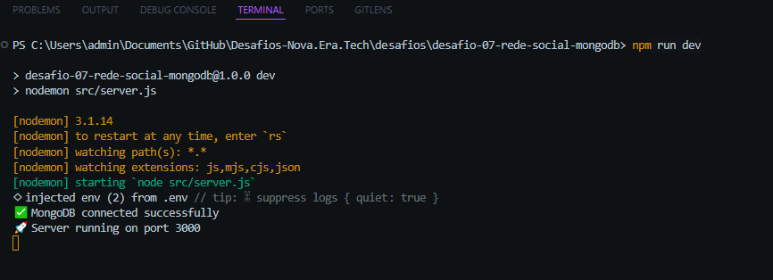
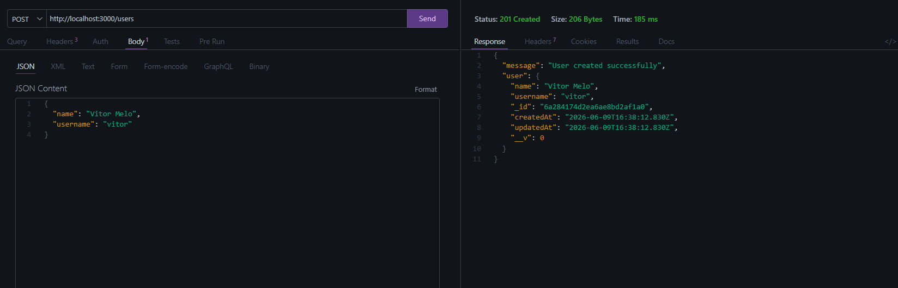
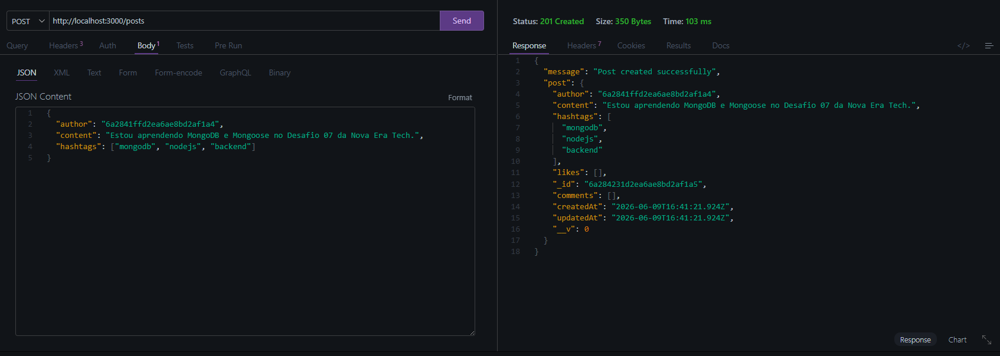
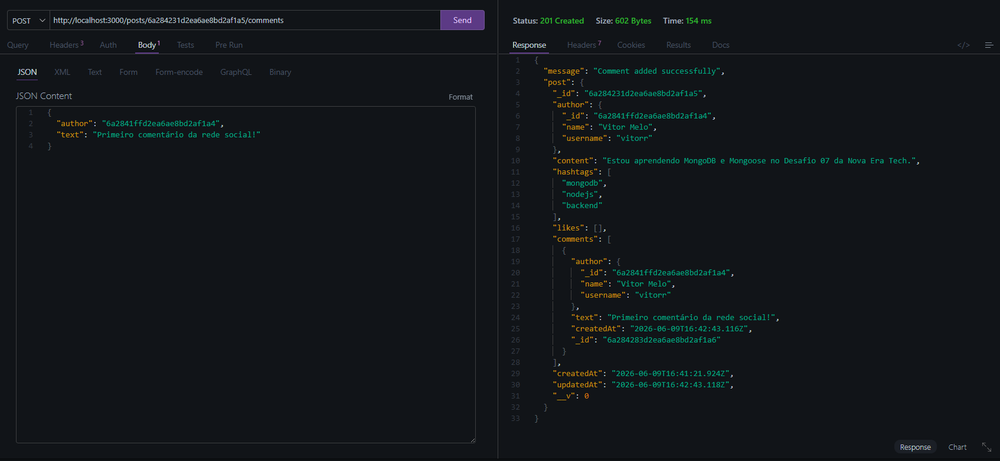
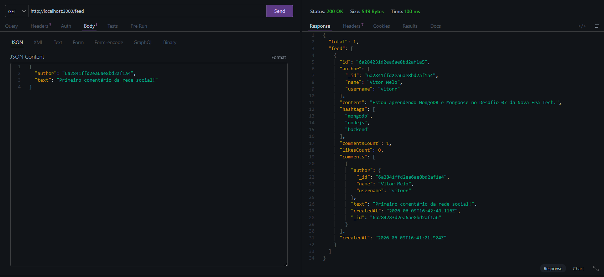
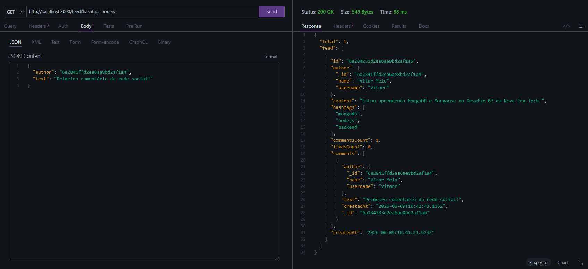

# 🚀 Desafio 07 — Rede Social com MongoDB

API REST desenvolvida com **Node.js**, **Express**, **MongoDB Atlas** e **Mongoose**, criada como parte dos desafios da **Nova Era Tech**.

O objetivo deste projeto é construir a base de uma mini rede social, utilizando documentos, referências, comentários embutidos, filtros por hashtag e consultas com agregação no MongoDB.

---

## 📸 Demonstração do Projeto

### ✅ Servidor rodando



### ✅ Criando usuário



### ✅ Criando post



### ✅ Comentando em um post



### ✅ Feed completo



### ✅ Feed filtrado por hashtag



---

## 🎯 Objetivo

Criar uma API de rede social simples com:

- Cadastro de usuários
- Criação de posts
- Comentários em posts
- Feed ordenado por data
- Filtro por hashtag
- Curtidas em posts
- Ranking de hashtags usando Aggregation Pipeline

---

## 🧠 Tecnologias utilizadas

- Node.js
- Express.js
- MongoDB Atlas
- Mongoose
- Dotenv
- CORS
- Nodemon

---

## 📦 Funcionalidades

### Usuários

- Criar usuário com nome e username
- Validação de campos obrigatórios
- Username único

### Posts

- Criar post
- Associar post a um usuário
- Adicionar conteúdo
- Adicionar hashtags
- Ordenar feed por data de criação

### Comentários

- Adicionar comentário em um post
- Associar comentário a um usuário
- Comentários embutidos dentro do documento do post

### Feed

- Buscar todos os posts
- Retornar autor do post
- Retornar comentários
- Retornar total de comentários
- Retornar total de curtidas
- Filtrar posts por hashtag

### Extras

- Curtir posts
- Buscar top hashtags com Aggregation Pipeline

---

## 🗂️ Estrutura de pastas

```txt
desafio-07-rede-social-mongodb/
├── images/
│   ├── terminal.png
│   ├── POST.png
│   ├── criar-post.png
│   ├── comentario.png
│   ├── feed.png
│   └── filtrar-post.png
├── src/
│   ├── config/
│   │   └── database.js
│   ├── controllers/
│   │   ├── postController.js
│   │   └── userController.js
│   ├── middlewares/
│   │   └── errorHandler.js
│   ├── models/
│   │   ├── Post.js
│   │   └── User.js
│   ├── routes/
│   │   ├── postRoutes.js
│   │   └── userRoutes.js
│   ├── app.js
│   └── server.js
├── .env
├── .gitignore
├── package.json
└── README.md
⚙️ Como rodar o projeto
1. Clone o repositório
git clone https://github.com/seu-usuario/seu-repositorio.git
2. Entre na pasta do projeto
cd desafio-07-rede-social-mongodb
3. Instale as dependências
npm install
4. Configure o arquivo .env

Crie um arquivo .env na raiz do projeto:

PORT=3000
MONGODB_URI=sua_string_de_conexao_do_mongodb_atlas
5. Rode o servidor
npm run dev

Se tudo estiver correto, o terminal exibirá:

✅ MongoDB connected successfully
🚀 Server running on port 3000
🔗 Endpoints da API
Criar usuário
POST /users

Exemplo de body:

{
  "name": "Vitor Melo",
  "username": "vitorr"
}

Resposta esperada:

{
  "message": "User created successfully",
  "user": {
    "name": "Vitor Melo",
    "username": "vitorr"
  }
}
Criar post
POST /posts

Exemplo de body:

{
  "author": "ID_DO_USUARIO",
  "content": "Estou aprendendo MongoDB e Mongoose no Desafio 07 da Nova Era Tech.",
  "hashtags": ["mongodb", "nodejs", "backend"]
}

Resposta esperada:

{
  "message": "Post created successfully",
  "post": {
    "content": "Estou aprendendo MongoDB e Mongoose no Desafio 07 da Nova Era Tech.",
    "hashtags": ["mongodb", "nodejs", "backend"],
    "comments": [],
    "likes": []
  }
}
Adicionar comentário
POST /posts/:id/comments

Exemplo de body:

{
  "author": "ID_DO_USUARIO",
  "text": "Primeiro comentário da rede social!"
}

Resposta esperada:

{
  "message": "Comment added successfully"
}
Buscar feed completo
GET /feed

Resposta esperada:

{
  "total": 1,
  "feed": [
    {
      "content": "Estou aprendendo MongoDB e Mongoose no Desafio 07 da Nova Era Tech.",
      "hashtags": ["mongodb", "nodejs", "backend"],
      "commentsCount": 1,
      "likesCount": 0
    }
  ]
}
Buscar feed por hashtag
GET /feed?hashtag=nodejs
Curtir post
POST /posts/:id/like

Exemplo de body:

{
  "userId": "ID_DO_USUARIO"
}
Top hashtags
GET /hashtags/top

Resposta esperada:

{
  "hashtags": [
    {
      "count": 1,
      "hashtag": "mongodb"
    },
    {
      "count": 1,
      "hashtag": "nodejs"
    }
  ]
}

🧱 Estratégia de modelagem

Neste projeto, os comentários foram modelados de forma embutida dentro do documento de post.

Essa escolha faz sentido para uma mini rede social de volume moderado, porque permite buscar o post junto com seus comentários de forma simples e rápida.

Já os usuários foram modelados de forma referenciada, usando ObjectId, pois um usuário pode estar relacionado a vários posts, comentários e curtidas.

⚡ Performance

Foram utilizados índices para melhorar as consultas principais:

postSchema.index({ createdAt: -1 });
postSchema.index({ hashtags: 1 });

Esses índices ajudam em:

Feed ordenado por data
Busca por hashtag
Consultas com volume moderado

✅ Critérios de aceite concluídos

 Fluxo de publicação funcionando
 Fluxo de comentários funcionando
 Feed ordenado por data
 Feed com metadados úteis
 Filtro por hashtag
 Validação de campos obrigatórios
 Consultas otimizadas com índices
 Curtidas em posts
 Top hashtags com Aggregation Pipeline
 
👨‍💻 Autor

Desenvolvido por Vitor Melo como parte dos desafios práticos da Nova Era Tech.
