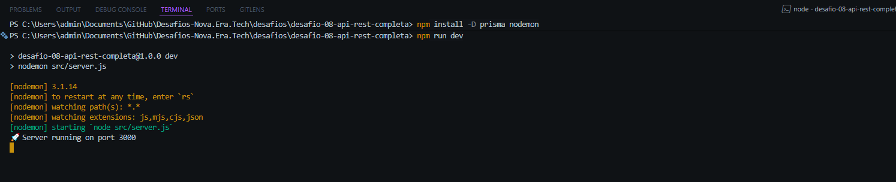
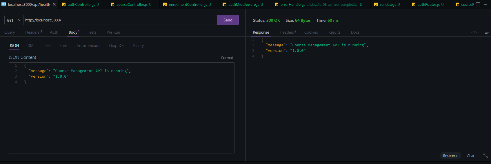
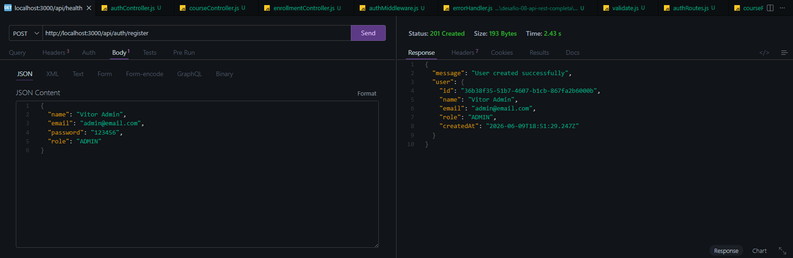
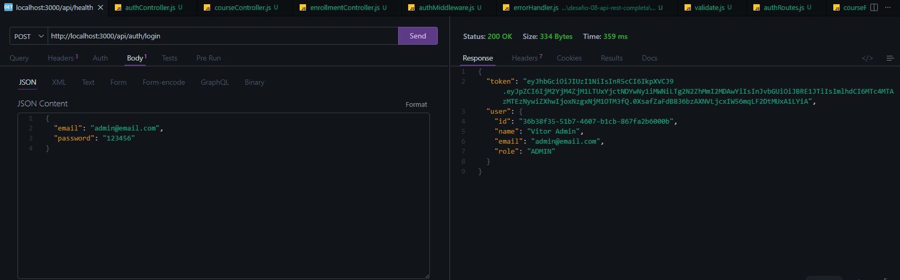
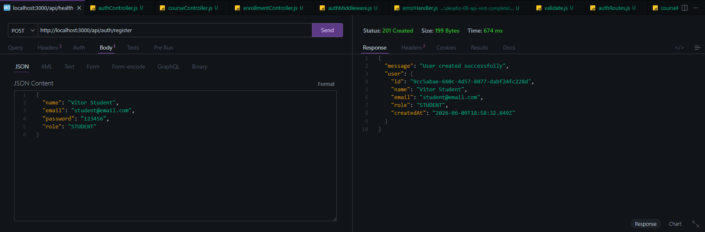
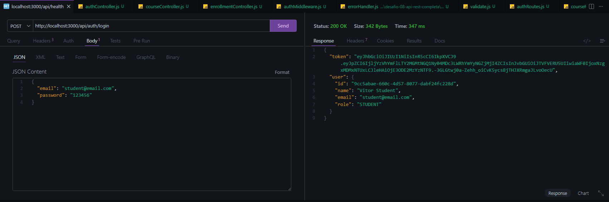
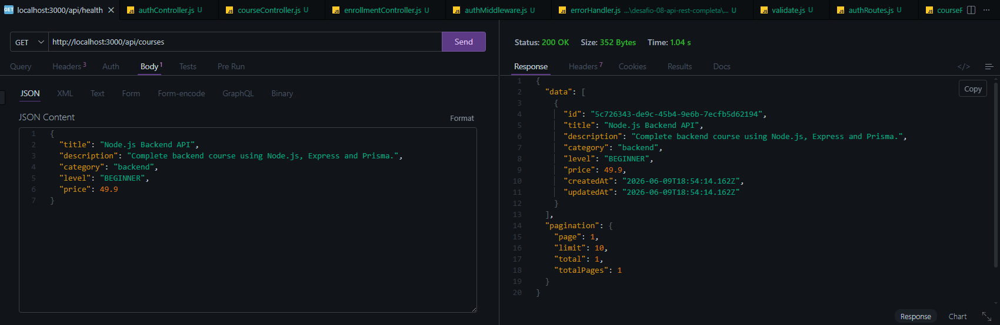
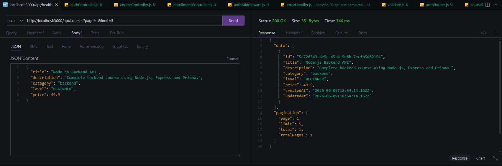
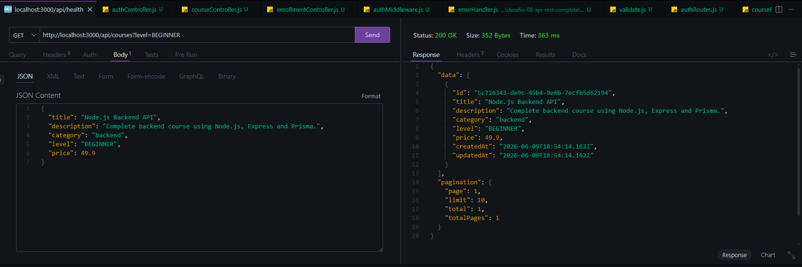
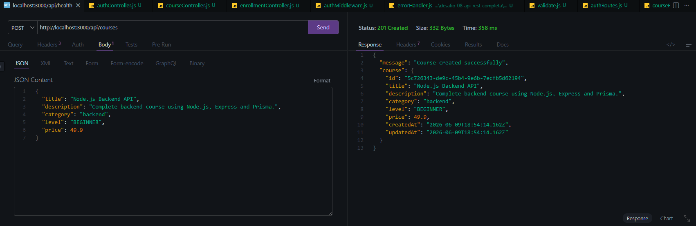

# 🚀 Course Management REST API

A complete and production-ready REST API built with **Node.js**, **Express**, **Prisma ORM**, and **PostgreSQL (Neon Database)**.

This project was developed as part of the **Nova Era Tech Backend Challenge #08**, focusing on authentication, authorization, pagination, filtering, validation, database relationships, and clean architecture.

---

# 🎯 Project Goal

Build a professional REST API capable of managing:

- Users
- Courses
- Enrollments

while implementing real-world backend concepts such as:

- JWT Authentication
- Role-based Authorization
- PostgreSQL Database
- Prisma ORM
- Data Validation
- Pagination
- Filtering
- Standardized Error Handling
- REST Best Practices

---

# 🛠️ Technologies

### Backend

- Node.js
- Express.js
- Prisma ORM
- PostgreSQL
- Neon Database

### Security

- JWT Authentication
- Password Hashing (bcryptjs)
- Protected Routes
- Role-based Access Control

### Validation

- Zod

### Development

- Nodemon
- Dotenv

---

# 📂 Project Structure

```bash
src/
│
├── config/
│   └── prisma.js
│
├── controllers/
│
├── middlewares/
│   ├── authMiddleware.js
│   ├── errorHandler.js
│   └── validate.js
│
├── routes/
│
├── schemas/
│
├── services/
│
├── utils/
│   └── AppError.js
│
├── app.js
└── server.js

prisma/
└── schema.prisma
```

---

# 🗄️ Database Models

## User

```json
{
  "id": "uuid",
  "name": "string",
  "email": "string",
  "password": "hashed",
  "role": "ADMIN | STUDENT"
}
```

## Course

```json
{
  "id": "uuid",
  "title": "string",
  "description": "string",
  "category": "string",
  "level": "BEGINNER | INTERMEDIATE | ADVANCED",
  "price": "number"
}
```

## Enrollment

```json
{
  "id": "uuid",
  "userId": "uuid",
  "courseId": "uuid"
}
```

---

# 🔐 Authentication & Authorization

The API uses JWT Authentication.

### Available Roles

```txt
ADMIN
STUDENT
```

### Permissions

| Action | ADMIN | STUDENT |
|----------|----------|----------|
| Register | ✅ | ✅ |
| Login | ✅ | ✅ |
| List Courses | ✅ | ✅ |
| View Course | ✅ | ✅ |
| Create Course | ✅ | ❌ |
| Update Course | ✅ | ❌ |
| Delete Course | ✅ | ❌ |
| Enroll in Course | ❌ | ✅ |
| View Own Courses | ❌ | ✅ |

---

# 📡 API Endpoints

## Authentication

### Register

```http
POST /api/auth/register
```

### Login

```http
POST /api/auth/login
```

---

## Courses

### Create Course

```http
POST /api/courses
```

### List Courses

```http
GET /api/courses
```

### Get Course By ID

```http
GET /api/courses/:id
```

### Update Course

```http
PUT /api/courses/:id
```

### Delete Course

```http
DELETE /api/courses/:id
```

---

## Enrollments

### Enroll User

```http
POST /api/enrollments
```

### My Courses

```http
GET /api/enrollments/my-courses
```

---

# 🔍 Pagination

Example:

```http
GET /api/courses?page=1&limit=5
```

Response:

```json
{
  "data": [],
  "pagination": {
    "page": 1,
    "limit": 5,
    "total": 10,
    "totalPages": 2
  }
}
```

---

# 🎯 Filtering

### By Category

```http
GET /api/courses?category=backend
```

### By Level

```http
GET /api/courses?level=BEGINNER
```

### Combined

```http
GET /api/courses?category=backend&level=BEGINNER
```

---

# ⚠️ Standardized Error Pattern

Example:

```json
{
  "code": "COURSE_NOT_FOUND",
  "message": "Course not found",
  "details": null
}
```

---

# 📸 Project Demonstration

## 🚀 Server Running



---

## 🌐 Initial Route



---

## 👨‍💻 Create Admin User



---

## 🔑 Admin Login



---

## 🎓 Create Student User



---

## 🔑 Student Login



---

## 📚 Course List



---

## 🔍 Filter By Category


---

## 📈 Pagination



---

## 🎯 Filter By Level



---

## 🔐 JWT Protected Routes



---

# 🚀 Running Locally

Clone the repository:

```bash
git clone https://github.com/your-user/desafio-08-api-rest-completa.git
```

Enter the project:

```bash
cd desafio-08-api-rest-completa
```

Install dependencies:

```bash
npm install
```

Configure environment variables:

```env
DATABASE_URL=your_database_url
JWT_SECRET=your_secret_key
PORT=3000
```

Run migrations:

```bash
npx prisma migrate dev
```

Generate Prisma Client:

```bash
npx prisma generate
```

Start server:

```bash
npm run dev
```

---

# 🧠 Concepts Practiced

- REST API Design
- Express Architecture
- Prisma ORM
- PostgreSQL
- Database Relationships
- Authentication
- Authorization
- JWT
- Password Hashing
- Validation with Zod
- Middleware
- Error Handling
- Pagination
- Filtering
- Layered Architecture

---

# 📈 What I Learned

During this challenge I strengthened my backend development skills by implementing a complete REST API following production-level practices.

Key takeaways:

- Designing scalable REST APIs
- Working with relational databases
- Managing authentication and permissions
- Building reusable services and middleware
- Implementing pagination and filtering
- Applying clean architecture principles

---

# 👨‍💻 Author

**Vitor Dutra Melo**

Backend Developer

- Node.js
- Express
- Prisma
- PostgreSQL
- JavaScript

LinkedIn: www.linkedin.com/in/vitor-dutra-melo

---

# ⭐ Challenge Status

✅ Completed Successfully

Nova Era Tech - Backend Challenge #08