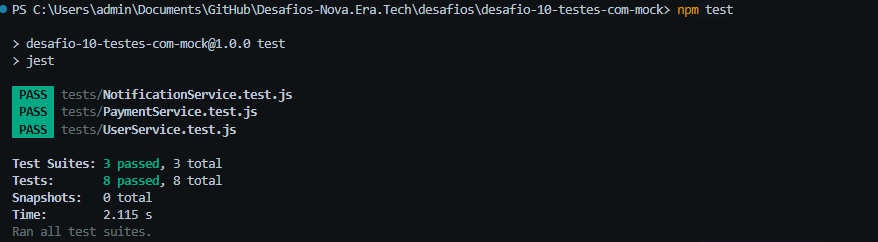
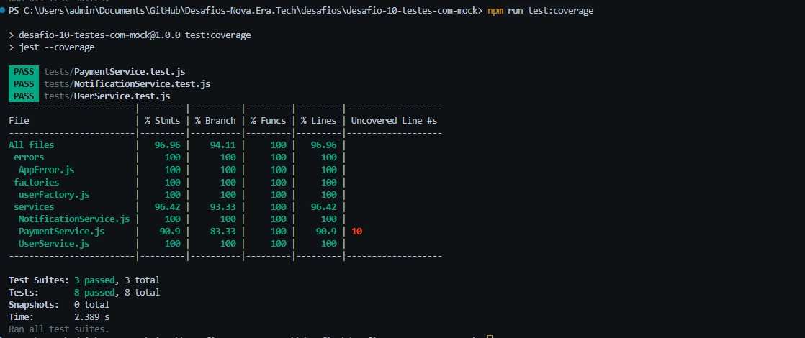

# 🚀 Challenge 10 — Unit Tests with Mocks

A complete Node.js project focused on unit testing business rules using **Jest**, **Mocks**, **Spies**, and **Dependency Injection**.

This challenge was developed as part of the **Nova Era Tech Backend Journey**, aiming to simulate real-world testing scenarios without relying on databases, external APIs, or queues.

---

# 📸 Project Preview

## ✅ All Tests Passing



---

## 📊 Test Coverage Report



---

# 🎯 Challenge Goal

The purpose of this project is to demonstrate how to:

- Isolate external dependencies
- Mock repositories and services
- Test business rules independently
- Validate side effects
- Create deterministic and fast unit tests

---

# 🛠 Technologies

- Node.js
- JavaScript
- Jest
- Mocks
- Spies
- Dependency Injection

---

# 📂 Project Structure

```text
desafio-10-testes-com-mock
│
├── src
│   ├── errors
│   │   └── AppError.js
│   │
│   ├── factories
│   │   └── userFactory.js
│   │
│   └── services
│       ├── UserService.js
│       ├── PaymentService.js
│       └── NotificationService.js
│
├── tests
│   ├── UserService.test.js
│   ├── PaymentService.test.js
│   └── NotificationService.test.js
│
├── package.json
├── jest.config.js
└── README.md
```

---

# 📋 Features Tested

## 👤 User Service

### Success Cases

- Create user successfully
- Validate repository calls

### Error Cases

- Duplicate email
- Missing required fields

---

## 💳 Payment Service

### Success Cases

- Process payment successfully

### Error Cases

- Invalid amount
- Gateway failure
- Missing user ID

---

## 📧 Notification Service

### Success Cases

- Queue welcome email successfully

### Error Cases

- Missing email address

---

# 🧪 Testing Concepts Applied

### Dependency Injection

External services are injected into business services, making them fully testable.

### Mocks

Repositories, gateways, and queues are mocked using:

```js
jest.fn()
```

### Spies

Function calls are validated using:

```js
expect(mock).toHaveBeenCalledWith(...)
```

### Async Testing

Promises are tested using:

```js
await expect(...).rejects.toThrow()
```

---

# 📈 Coverage

Current coverage:

| Metric     | Result |
| ---------- | ------- |
| Statements | 96.96% |
| Branches   | 94.11% |
| Functions  | 100% |
| Lines      | 96.96% |

This demonstrates strong confidence in the business logic and critical application flows.

---

# 🚀 Running the Project

Install dependencies:

```bash
npm install
```

Run tests:

```bash
npm test
```

Run coverage:

```bash
npm run test:coverage
```

---

# 🎓 Skills Demonstrated

- Unit Testing
- Mocking Dependencies
- Business Logic Validation
- Error Handling
- Clean Architecture Principles
- Dependency Injection
- Jest Best Practices

---

# 👨‍💻 Author

**Vitor Dutra Melo**

Backend Developer focused on:

- Node.js
- Express.js
- PostgreSQL
- Prisma ORM
- REST APIs
- Software Architecture

---

# 📜 License

This project is licensed under the MIT License.