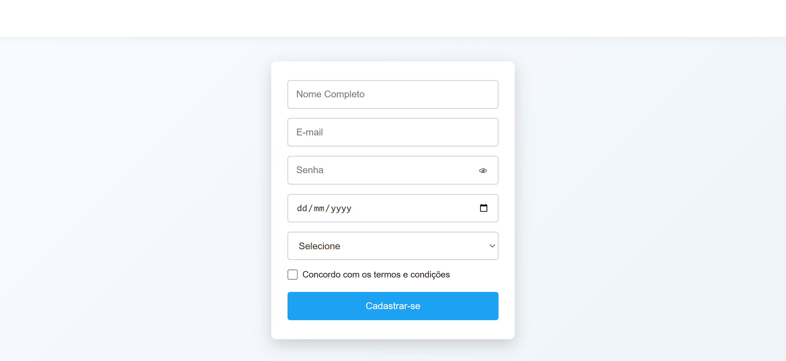

# 🚀 Challenge 03 — Registration Form

This is the third HTML challenge from the **Nova Era Tech Frontend Formation**.

## 🎯 Objective

Build a clean and responsive registration form using semantic HTML and modern CSS while practicing the main HTML form elements.

---

## 🛠 Technologies Used

- HTML5
- CSS3
- JavaScript (Vanilla)

---

## 📦 Features

- Full Name input
- Email input
- Password input
- Show/Hide Password button
- Date of Birth input
- Gender selection
- Terms and Conditions checkbox
- Submit button
- Success message after submission
- Responsive layout
- Modern card-based UI

---

## 📸 Preview



---

## 📁 Project Structure

```text
challenge-03-registration-form/
│
├── index.html
├── style.css
├── script.js
│
├── images/
│   └── front.png
│
└── README.md
```

---

## 📚 What I Practiced

- Semantic HTML5
- Form creation
- Labels and placeholders
- Input types
- Select elements
- Checkboxes
- Buttons
- HTML validation
- Password visibility toggle
- Basic DOM manipulation
- Responsive design with CSS
- Flexbox layout
- User interface organization

---

## 🚀 Getting Started

1. Clone this repository

```bash
git clone https://github.com/your-username/challenge-03-registration-form.git
```

2. Open the project folder

```bash
cd challenge-03-registration-form
```

3. Open `index.html` in your browser.

---

## 🎯 Challenge Requirements

- ✅ Organized registration form
- ✅ Proper HTML labels
- ✅ Correct input types
- ✅ Terms acceptance checkbox
- ✅ Submit button
- ✅ HTML validation
- ✅ Responsive design
- ✅ Success message
- ✅ Clean code structure

---

## 📖 Learning Outcomes

By completing this project, I strengthened my understanding of HTML forms, semantic markup, user input validation, responsive layouts, and basic JavaScript interactions.

---

## 👨‍💻 Author

**Vitor Dutra Melo**

Backend & Full Stack Developer in progress 🇧🇷

GitHub: https://github.com/SEU-USUARIO

---

⭐ This project is part of the **Nova Era Tech Frontend Challenges**.