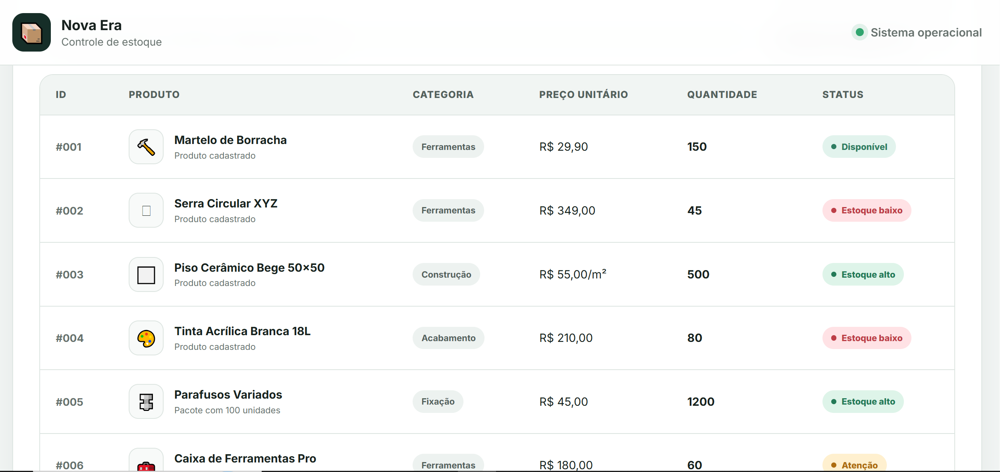

# 🚀 Challenge 04 — Product Inventory Table

This project was developed as part of the **Nova Era Tech Frontend Formation**.

The goal of this challenge was to practice HTML table structure, semantic organization, CSS styling, responsive design, and basic JavaScript interactions by creating a product inventory management interface.

---

## 📖 About the Project

The application simulates an inventory management dashboard for the **Nova Era Warehouse**.

Users can view product information, search for products, filter products by category, identify stock levels, and add new products through an interactive form.

The interface was designed to provide a clean, modern, and responsive experience on desktop, tablet, and mobile devices.

---

## 📸 Project Preview



---

## 🛠 Technologies Used

- HTML5
- CSS3
- JavaScript
- Responsive Design
- Semantic HTML

---

## 📦 Features

- Product inventory table
- Product ID
- Product name
- Product category
- Unit price
- Stock quantity
- Stock status indicators
- Product search
- Category filtering
- Add-product modal
- Dynamic inventory statistics
- Responsive layout
- Mobile-friendly table scrolling
- Accessible and semantic structure

---

## 🧱 HTML Table Structure

The product table was built using the main semantic HTML table elements:

- `table`
- `caption`
- `thead`
- `tbody`
- `tfoot`
- `tr`
- `th`
- `td`

This structure improves accessibility, readability, and content organization.

---

## 📊 Inventory Dashboard

The dashboard displays important inventory information, including:

- Total number of products
- Number of products with low stock
- Total number of available units

These values are automatically updated when a new product is added.

---

## 🚦 Stock Status

Products receive a visual status based on their available quantity:

| Quantity | Status |
|---|---|
| Up to 50 units | Low Stock |
| 51 to 100 units | Attention |
| 101 to 499 units | Available |
| 500 units or more | High Stock |

---

## 🔍 Search and Filtering

The application allows users to:

- Search products by name
- Search products by ID
- Search products by category
- Filter products using the category selector

When no product matches the search, an empty-state message is displayed.

---

## ➕ Adding New Products

The **Add Product** button opens a form where users can enter:

- Product ID
- Product name
- Category
- Unit price
- Stock quantity

After submitting the form, the new product is dynamically added to the table.

The application also prevents duplicate product IDs.

---

## 📱 Responsive Design

The layout adapts to different screen sizes.

On smaller devices:

- Dashboard cards are displayed vertically
- Form fields are reorganized
- Buttons use the full available width
- The table receives horizontal scrolling
- Content remains readable without breaking the page layout

---

## 📁 Project Structure

```text
challenge-04-product-table/
│
├── index.html
├── style.css
├── script.js
├── README.md
│
└── images/
    └── tabela.png
```

---

## ▶️ How to Run the Project

1. Clone the repository:

```bash
git clone YOUR_REPOSITORY_URL
```

2. Open the project folder:

```bash
cd challenge-04-product-table
```

3. Open the `index.html` file in your browser.

You can also use the **Live Server** extension in Visual Studio Code.

---

## 🎯 Challenge Requirements

The project follows the challenge requirements:

- [x] Product name
- [x] Product category
- [x] Unit price
- [x] Stock quantity
- [x] Use of `thead`
- [x] Use of `tbody`
- [x] Use of `tfoot`
- [x] Semantic HTML structure
- [x] Organized and readable information
- [x] Custom CSS styling
- [x] Visual header highlights
- [x] Responsive design
- [x] JavaScript interactions

---

## 📚 What I Practiced

During this challenge, I practiced:

- Creating semantic HTML tables
- Organizing structured data
- Styling tables with CSS
- Creating responsive layouts
- Working with modal forms
- Manipulating the DOM with JavaScript
- Filtering table content
- Updating interface statistics dynamically
- Improving accessibility
- Organizing frontend project files

---

## 🔮 Future Improvements

Possible future improvements include:

- Edit existing products
- Delete products
- Save products using Local Storage
- Sort products by price or quantity
- Add product images
- Create pagination
- Connect the interface to a backend API
- Store products in a database
- Add user authentication

---

## 👨‍💻 Author

Developed by **Vitor Dutra Melo**.

This project is part of my frontend development learning journey at **Nova Era Tech**.

---

## 📄 License

This project was created for educational purposes.