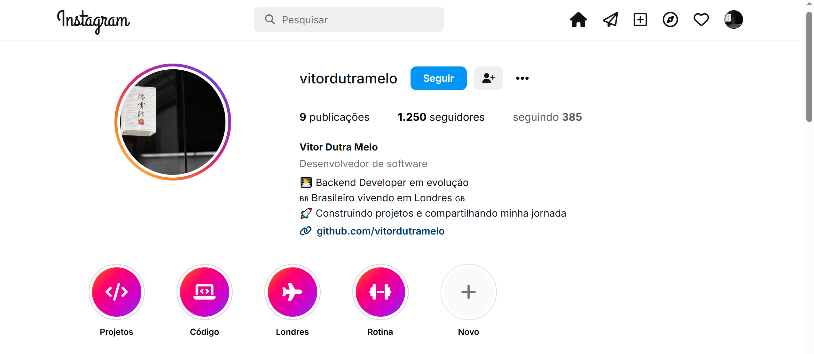
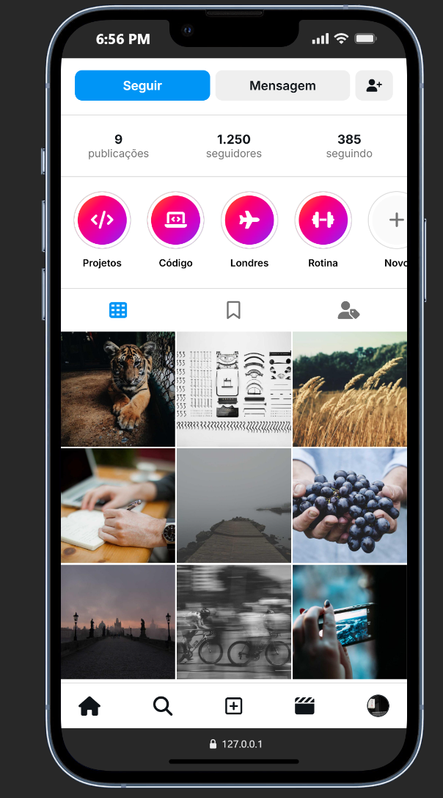

# 📸 Challenge 08 — Instagram Profile Clone

This project was developed as part of the **Nova Era Tech Frontend Formation**.

The goal of this challenge was to recreate a modern **Instagram-inspired profile page** using only **HTML5** and **CSS3**, focusing on layout organization, responsive design, and visual components.

---

# 📖 About the Project

This project reproduces the look and feel of an Instagram profile page, including:

- Profile photo
- Username
- Biography
- Statistics
- Action buttons
- Story highlights
- Responsive image gallery
- Mobile-friendly layout

The page was built with clean and semantic HTML and modern CSS techniques.

---

# 🛠 Technologies Used

- HTML5
- CSS3
- Flexbox
- CSS Grid
- Responsive Design
- Font Awesome Icons
- Google Fonts

---

# ✨ Features

✅ Instagram-inspired layout

✅ Profile picture section

✅ User biography

✅ Followers and following statistics

✅ Action buttons

✅ Story highlights

✅ Responsive image gallery

✅ Hover effects on posts

✅ Mobile navigation

✅ Fully responsive design

---

# 📸 Project Preview

## 💻 Desktop Version



---

## 📱 Mobile Version



---

# 📂 Project Structure

```text
challenge-08-instagram-profile/
│
├── index.html
├── style.css
│
└── images/
    ├── profile.png
    └── mobile.png
```

---

# 🎯 What I Practiced

- Semantic HTML5
- CSS Flexbox
- CSS Grid
- Responsive layouts
- Margin and padding
- Image organization
- Hover effects
- Visual hierarchy
- Modern UI development

---

# 🚀 How to Run

1. Clone the repository:

```bash
git clone https://github.com/your-username/challenge-08-instagram-profile.git
```

2. Open the project folder.

3. Open the `index.html` file in your browser.

Or run it using the **Live Server** extension in Visual Studio Code.

---

# 📚 Learning Goals

This challenge helped reinforce:

- HTML page structure
- Modern CSS layouts
- Responsive web development
- Grid systems
- User interface design
- Clean and organized code

---

# 👨‍💻 Author

Developed by **Vitor Dutra Melo** as part of the **Nova Era Tech Frontend Formation**.