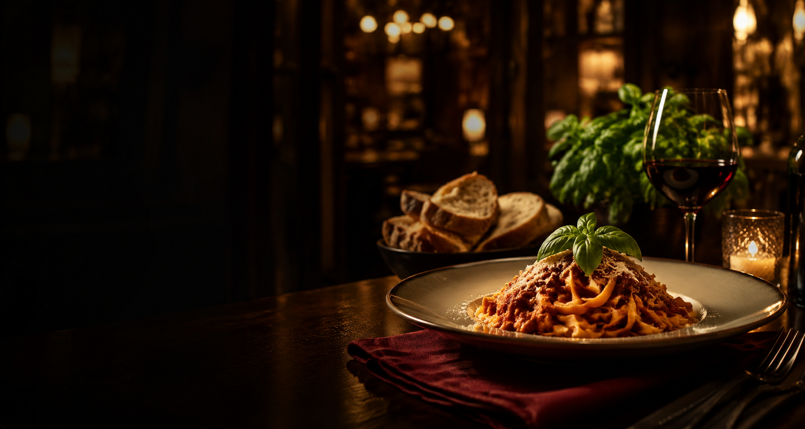

# 🚀 Desafio 09 — Página de Restaurante

Página institucional responsiva para o restaurante fictício **Sabor & Brasa**, desenvolvida com HTML5 e CSS3.

## 🎯 Sobre o projeto

O objetivo é praticar a criação de uma página moderna, visualmente atraente e organizada para apresentar um restaurante, seus pratos e informações de contato.

## 🛠 Tecnologias

- HTML5
- CSS3
- JavaScript básico para o menu mobile
- Google Fonts

## ✅ Funcionalidades

- Banner principal com imagem de fundo
- Menu de navegação fixo
- Cardápio em cards
- Seção sobre o restaurante
- Galeria com efeitos hover
- Informações de contato
- Formulário de reserva
- Rodapé com redes sociais
- Layout totalmente responsivo
- Boas práticas de acessibilidade

## 📁 Estrutura

```text
desafio-09-restaurante/
├── images/
│   └── hero-restaurante.png
├── index.html
├── style.css
└── README.md
```

## ▶️ Como executar

1. Baixe ou clone o projeto.
2. Abra a pasta no Visual Studio Code.
3. Abra o arquivo `index.html` no navegador ou utilize a extensão Live Server.

## 📱 Responsividade

O layout foi desenvolvido para funcionar em celulares, tablets e computadores. Em telas menores, o menu de navegação se transforma em um menu mobile.

## 📸 Preview



---

Desenvolvido para o **Desafio 09 da Formação Nova Era Tech**.
