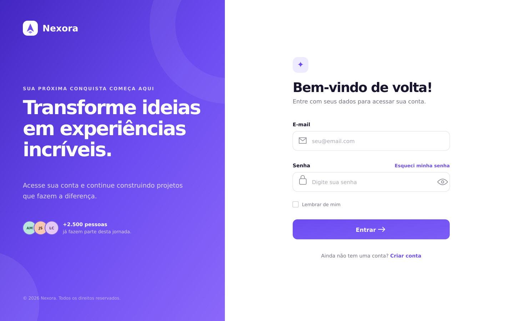

# 🚀 Desafio 10 — Tela de Login Moderna

Este projeto foi desenvolvido como parte dos **Desafios Nova Era**, com o objetivo de praticar a criação de uma interface moderna de login utilizando HTML, CSS e JavaScript.

---

## 📸 Preview do projeto



---

## 🎯 Objetivo

Criar uma tela de login moderna, responsiva e agradável, trabalhando formulários, alinhamentos, espaçamentos, bordas, sombras e estados de interação.

---

## 🛠 Tecnologias utilizadas

- HTML5
- CSS3
- JavaScript
- Google Fonts

---

## ✨ Funcionalidades

- Campo de e-mail
- Campo de senha
- Botão para mostrar ou ocultar a senha
- Validação dos campos do formulário
- Mensagens de erro acessíveis
- Opção “Lembrar de mim”
- Link “Esqueci minha senha”
- Confirmação visual de login válido
- Efeitos de `hover` e `focus`
- Ícones nos campos
- Layout responsivo para desktop, tablet e celular

---

## 📱 Responsividade

No desktop, a página utiliza duas colunas: uma área de apresentação da marca e o formulário de login. Em telas menores, o painel lateral é removido e o formulário passa a ocupar toda a largura disponível.

---

## 📁 Estrutura do projeto

```text
desafio-10-tela-login-moderna/
├── images/
│   └── preview-login.png
├── index.html
├── style.css
├── script.js
└── README.md
```

---

## ▶️ Como executar

1. Clone este repositório:

```bash
git clone URL-DO-SEU-REPOSITORIO
```

2. Entre na pasta do projeto:

```bash
cd desafio-10-tela-login-moderna
```

3. Abra o arquivo `index.html` no navegador.

Também é possível utilizar a extensão **Live Server** no Visual Studio Code.

---

## 📚 Aprendizados

Neste desafio foram praticados:

- Estruturação semântica de formulários
- Organização de estilos em arquivo separado
- Centralização e alinhamento com CSS Grid e Flexbox
- Validação básica de formulário com JavaScript
- Responsividade com media queries
- Estados de foco, hover, erro e sucesso
- Boas práticas básicas de acessibilidade

---

## 👨‍💻 Autor

Desenvolvido por **Vitor Dutra Melo**.

