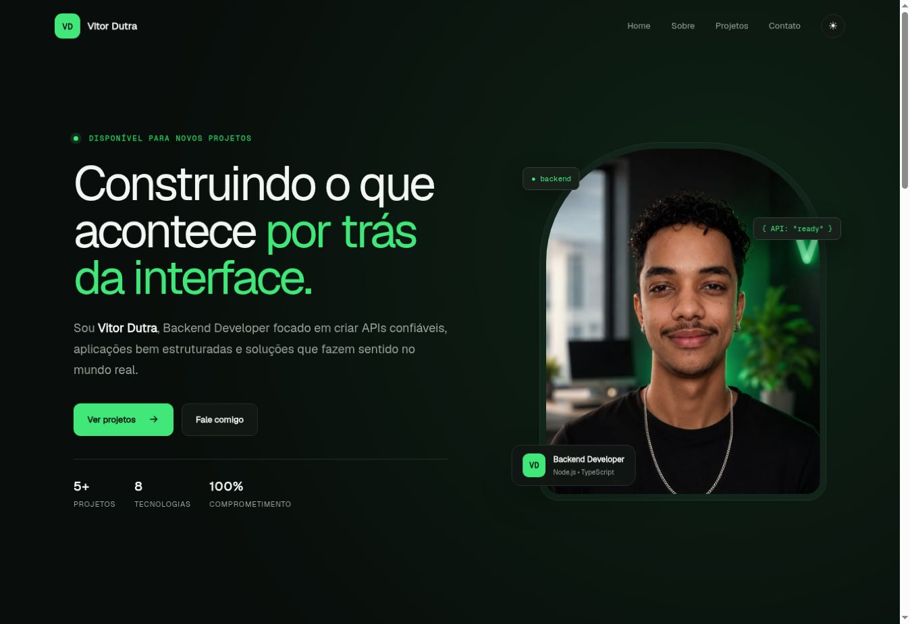

# 🚀 Desafio 11 — Portfólio Profissional

Portfólio profissional desenvolvido para apresentar **Vitor Dutra — Backend Developer**, seus conhecimentos, projetos e formas de contato.

O projeto foi criado exclusivamente com **HTML5, CSS3 e JavaScript puro**, sem frameworks ou bibliotecas de interface.

---

## 📖 Sobre o projeto

A página reúne uma apresentação profissional completa, com navegação entre as seções Home, Sobre, Projetos e Contato.

O portfólio destaca cinco projetos: Porquin Finance, BabyTracker, Rare Drop, My Gym Day e FridgeChef.

---

## 🛠 Tecnologias utilizadas

- HTML5
- CSS3
- JavaScript
- Google Fonts

---

## ✨ Funcionalidades

- Navegação suave entre as seções
- Menu responsivo para celulares
- Tema claro e escuro com preferência salva no navegador
- Animações durante a rolagem
- Cards interativos com efeitos hover
- Links de contato
- Layout adaptado para desktop, tablet e celular
- Estrutura HTML semântica e acessível

---

## 📁 Estrutura de pastas

```text
portfolio-vitor-dutra/
├── images/
│   ├── preview.png
│   └── vitor-dutra.jpeg
├── index.html
├── style.css
├── script.js
└── README.md
```

---

## 📸 Preview do projeto



---

## ▶️ Como executar

1. Faça o download ou clone este repositório.
2. Abra a pasta do projeto.
3. Abra o arquivo `index.html` no navegador.

Não é necessário instalar dependências.

---

## ✏️ Personalização dos contatos

No arquivo `index.html`, substitua os textos e os valores de `href` dos links de LinkedIn e e-mail pelos seus dados reais.

---

## 👨‍💻 Autor

Desenvolvido por **Vitor Dutra**.

- [GitHub](https://github.com/VitorDutraMelo)

---

## 📄 Licença

Este projeto foi desenvolvido para fins de estudo e portfólio.
