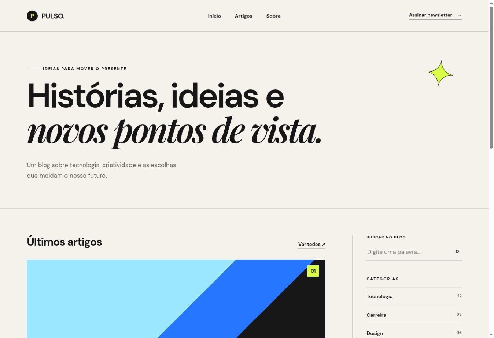

# 🚀 Desafio 13 — Blog Estático

Blog moderno e responsivo desenvolvido com HTML5 e CSS3 puro. O projeto apresenta uma identidade editorial chamada **Pulso**, com conteúdo sobre tecnologia, carreira e criatividade.



## 🎯 Objetivo

Praticar a organização de conteúdo e a construção de um layout profissional utilizando HTML semântico e CSS moderno.

## ✨ Funcionalidades

- Header com navegação
- Área principal de posts
- Sidebar com busca visual
- Lista de categorias
- Card sobre o blog
- Formulário visual de newsletter
- Footer com links sociais
- Layout responsivo para celular, tablet e desktop
- Tema escuro automático conforme a preferência do dispositivo
- Efeitos de hover e navegação suave

## 🛠 Tecnologias

- HTML5
- CSS3
- Flexbox
- CSS Grid
- Media Queries
- Seletores avançados
- Unidades responsivas com `clamp()`

## 📁 Estrutura

```text
desafio-13-blog-estatico/
├── images/
│   └── preview.jpg
├── index.html
├── styles.css
└── README.md
```

## ▶️ Como executar

1. Baixe ou clone este repositório.
2. Abra a pasta do projeto.
3. Abra o arquivo `index.html` no navegador.

Não é necessário instalar dependências.

## ✅ Critérios atendidos

- [x] Header
- [x] Sidebar
- [x] Área de posts
- [x] Footer
- [x] Layout organizado e agradável
- [x] Estrutura semântica e código limpo
- [x] Navegação clara
- [x] Categorias
- [x] Busca visual
- [x] Tema dark
- [x] Responsividade

## 👨‍💻 Autor

Desenvolvido por **Vitor Dutra** como parte dos Desafios Nova Era.
