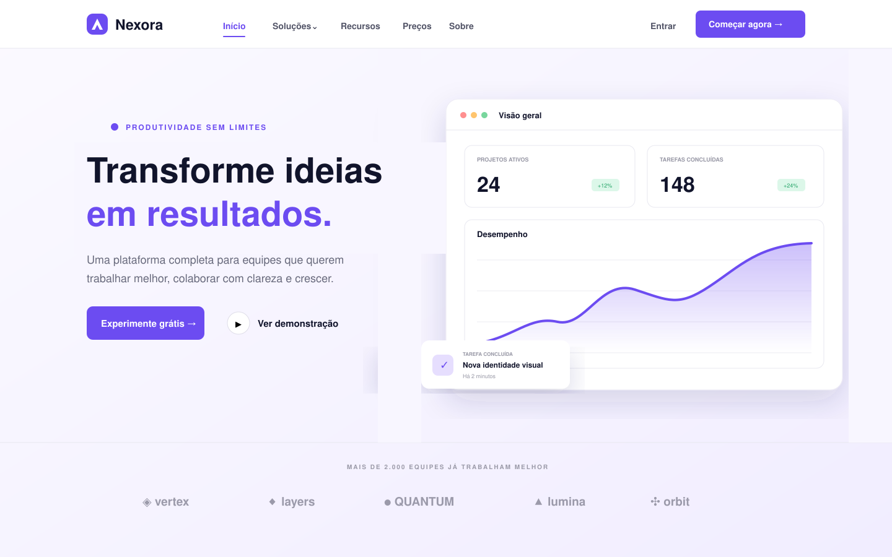

# 🚀 Desafio 14 — Navbar Profissional

Projeto desenvolvido como parte dos desafios de Front-end da **Nova Era Tech**. O objetivo foi criar uma navegação moderna, organizada e responsiva, semelhante às utilizadas em sistemas reais.

## 🎯 Objetivo

Praticar a construção de uma navbar profissional utilizando HTML semântico, seletores avançados, pseudo-classes e interações visuais.

## 🧠 Tecnologias utilizadas

- HTML5
- CSS3
- JavaScript
- Google Fonts
- SVG inline para ícones e elementos gráficos

## ✅ Funcionalidades implementadas

- Links principais de navegação
- Destaque visual para o link ativo
- Efeitos de `hover` e foco
- Submenu funcional em **Soluções**
- Menu hambúrguer responsivo
- Animações suaves de abertura e interação
- Fechamento dos menus pela tecla `Esc`
- Estrutura semântica e atributos de acessibilidade
- Layout adaptado para desktop, tablet e celular

## 📁 Estrutura do projeto

```text
desafio-14-navbar/
├── images/
│   └── preview.png
├── index.html
├── style.css
├── script.js
└── README.md
```

## 🖼️ Preview



## 🚀 Como executar

1. Clone este repositório:

```bash
git clone https://github.com/Escola-Nova-Era/form-web.git
```

2. Entre na pasta do desafio:

```bash
cd form-web/desafio-14-navbar
```

3. Abra o arquivo `index.html` no navegador.

Também é possível utilizar a extensão **Live Server** no Visual Studio Code.

## 📚 O que foi praticado

- Organização e alinhamento com Flexbox e Grid
- Pseudo-classes `:hover`, `:focus-visible` e `:focus-within`
- Seletores avançados e variáveis CSS
- Posicionamento de submenu
- Responsividade com media queries
- Manipulação de classes e atributos ARIA com JavaScript
- Boas práticas de acessibilidade e navegação por teclado

## 👨‍💻 Autor

Desenvolvido por **Vitor Dutra** durante a trilha de desafios da Nova Era Tech.

---

⭐ Se este projeto ajudou você, deixe uma estrela no repositório!
