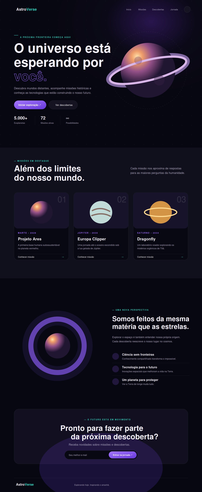

# 🚀 Desafio 15 — Página Temática Completa

Projeto final da Formação Web Full Stack da **Escola Nova Era**. A proposta foi desenvolver uma página completa com tema livre, reunindo os principais conhecimentos praticados ao longo da formação.

O tema escolhido foi **AstroVerse**, uma experiência visual sobre exploração espacial, missões e descobertas científicas.

---

## 🎯 Objetivo

Criar uma página temática profissional, organizada e funcional utilizando HTML, CSS e JavaScript puros.

---

## 🧠 Tecnologias utilizadas

- HTML5 semântico
- CSS3
- JavaScript Vanilla
- Flexbox e CSS Grid
- Media Queries
- LocalStorage
- Intersection Observer API

---

## ✨ Funcionalidades implementadas

- Header fixo com navegação funcional
- Banner principal com chamada para ação
- Seção de missões com cards interativos
- Seção informativa sobre exploração espacial
- Formulário de newsletter com validação
- Footer completo com links sociais
- Menu responsivo para dispositivos móveis
- Dark mode e light mode com preferência salva
- Animações de entrada durante a rolagem
- Efeitos hover em botões, cards e links
- Rolagem suave entre as seções
- Respeito à preferência de movimento reduzido

---

## 📁 Estrutura do projeto

```text
desafio-15-pagina-tematica/
├── images/
│   ├── preview.png
├── index.html
├── style.css
├── script.js
└── README.md
```

---

## 🖼️ Preview



---

## ▶️ Como executar

1. Baixe ou clone este repositório.
2. Abra a pasta do projeto.
3. Abra o arquivo `index.html` no navegador.

Não é necessário instalar dependências.

---

## 📚 O que foi praticado

- Criação de identidade visual
- Organização profissional de HTML e CSS
- Uso de classes reutilizáveis
- Seletores e pseudo-classes
- Layouts com Flexbox e Grid
- Responsividade para diferentes telas
- Acessibilidade básica
- Interações com JavaScript
- Boas práticas de estrutura e manutenção

---

## ✅ Status

**Desafio concluído com o MVP e todos os recursos opcionais.**

---

## 👨‍💻 Autor

Desenvolvido por **Vitor Dutra** como parte da Formação Web Full Stack da Escola Nova Era.

🎉 **Formação concluída!**
