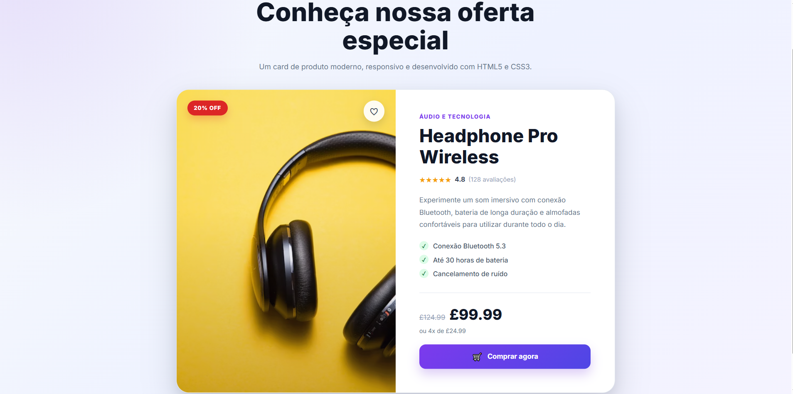

# 🚀 Challenge 06 — Product Card

This project was developed as part of the **Nova Era Tech Frontend Formation**.

The goal of this challenge was to create a modern and responsive **Product Card** using **HTML5** and **CSS3**, practicing visual design, spacing, typography, borders, shadows, and responsive layouts.

---

# 📖 About the Project

This project showcases a modern product card inspired by e-commerce websites.

The card includes:

- Product image
- Product category
- Product name
- Customer rating
- Product description
- Product features
- Original and promotional prices
- Purchase button
- Discount badge
- Favorite button

The layout was designed with responsiveness in mind, providing a clean experience across desktop, tablet, and mobile devices.

---

# 🛠 Technologies Used

- HTML5
- CSS3
- Google Fonts
- Flexbox
- CSS Grid

---

# 📦 Features

✅ Modern product card

✅ Semantic HTML structure

✅ Separate CSS file

✅ Product image

✅ Product title

✅ Product description

✅ Product rating

✅ Product features list

✅ Original and promotional prices

✅ Purchase button

✅ Discount badge

✅ Favorite button

✅ Hover animations

✅ Image zoom effect

✅ Responsive layout

✅ Clean and modern UI

---

# 📸 Project Preview



---

# 📁 Project Structure

```text
challenge-06-product-card/
│
├── images/
│   └── loja.png
│
├── index.html
├── style.css
├── .gitignore
└── README.md
```

---

# ▶️ Getting Started

Clone the repository:

```bash
git clone https://github.com/your-username/challenge-06-product-card.git
```

Open the project folder:

```bash
cd challenge-06-product-card
```

Run the project by opening the `index.html` file in your browser.

Or use **Live Server** in Visual Studio Code.

---

# 📱 Responsive Design

The layout automatically adapts to different screen sizes:

- 💻 Desktop
- 📱 Tablet
- 📱 Mobile

The card changes from a two-column layout to a single-column layout on smaller screens, ensuring a better user experience.

---

# 🎯 Challenge Requirements

## MVP

- ✅ Product image
- ✅ Product name
- ✅ Product description
- ✅ Product price
- ✅ Purchase button

## Technical Requirements

- ✅ Proper spacing
- ✅ Visual alignment
- ✅ Borders
- ✅ Shadows
- ✅ Well-organized structure
- ✅ Separate CSS file

## Bonus Features

- ✅ Button hover effect
- ✅ Card hover animation
- ✅ Image zoom effect
- ✅ Responsive layout
- ✅ Favorite button
- ✅ Discount badge

---

# 🧠 What I Practiced

During this project I improved my knowledge of:

- Semantic HTML5
- CSS Box Model
- Margin & Padding
- Flexbox
- CSS Grid
- Typography
- Borders
- Border Radius
- Box Shadow
- Hover Effects
- CSS Transitions
- Responsive Design
- Media Queries
- UI Component Design

---

# 🎓 Learning Outcome

After completing this challenge, I became more comfortable creating reusable UI components similar to those used in modern e-commerce applications.

This project also strengthened my understanding of CSS layout techniques and responsive web design.

---

# 👨‍💻 Author

Developed by **Vitor Dutra Melo** as part of the **Nova Era Tech Frontend Formation**.